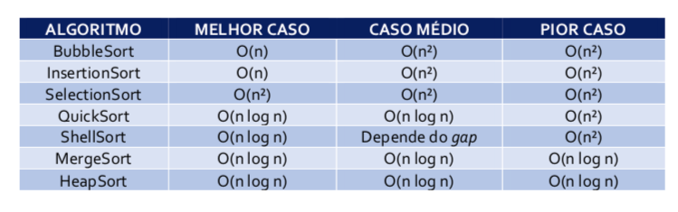
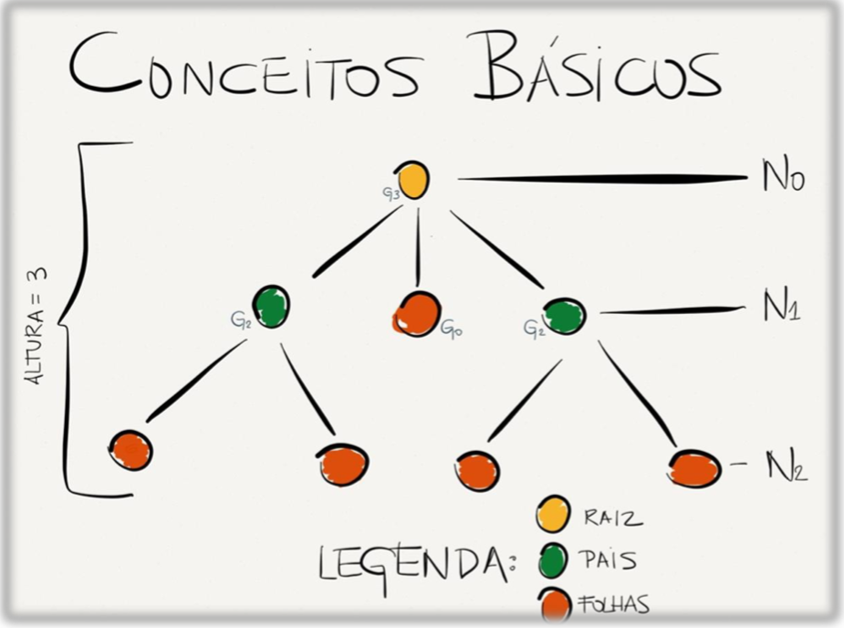

# Aula Algoritmos Ordenação

## Bubble Sort

## Quick Sort

Arrays ordenados ou Inversos

https://stackoverflow.com/questions/29240519/quicksort-java-lang-stackoverflowerror

500.000 --> 105ms contra 34028ms do Insertion Sort

> Dual Pivo quick Sort - Arrays.sort java
>
>

## Shell Sort

Pior caso tende a ser melhor que o QuickSort

Melhor caso na complexidade exponencial 

> comparar no pior caso: quick, shell, insert

## Merge Sort

Pior caso, 5000 tende a ser melhor que o QuickSort

# Estrutura de Dados

## Pilha

Métodos

* pop
* push
* peek
* top

Falar do problema da Herança

* capacity x size

## Fila

* peek
* add x offer
* poll

## Árvore

