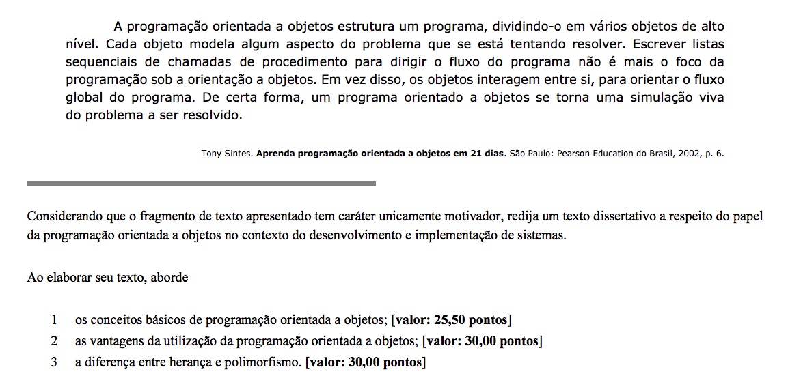
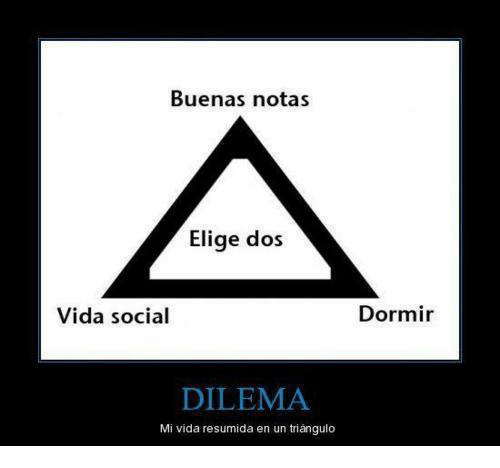
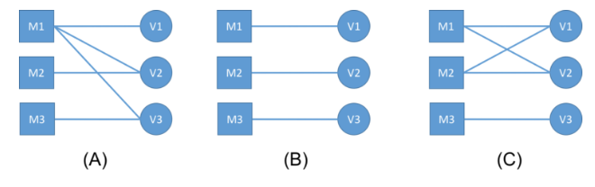
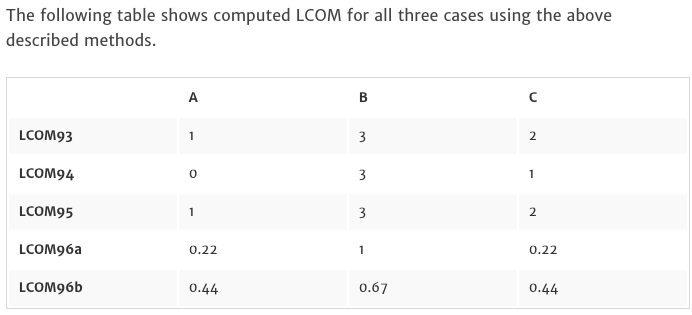
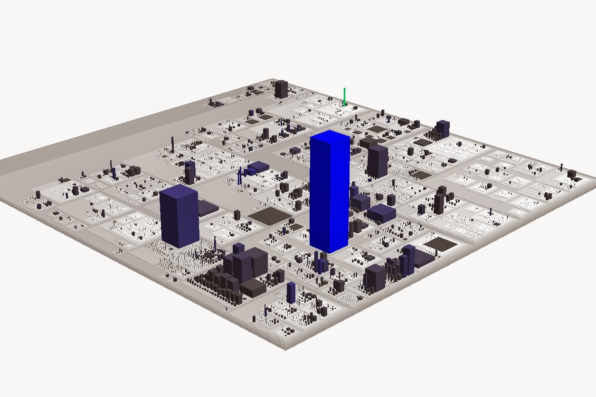

@title[Aula de O.O]
# O.O para concursos

### Raphael Lacerda
---

## Indo direto ao ponto

> Cespe [ABIN 2018](http://www.cespe.unb.br/concursos/abin_17/arquivos/378_ABIN_DISC_013_01.PDF) - Área 9

---

@snap[north-west span-50]
## mas antes de você pular...
@snapend

@snap[east span-50]

@snapend

Note:

- Triângulo da vitória: Organização, Conteúdo, Motivação
- Sorte ao Redor
- Detalhar o conteúdo Tech x Concurseiro
- Você sabe sobre encapsulamento? Ok, mas vc sabe me explicar a métrica LCOM que é cobrada em concurso?
---

@snap[west span-50]
## Então vamos lá
@snapend

@snap[east span-50]

@snapend

Note:

- Explicar encapsulamento até aqui

---
## concurso grande, questão...

@ul[spaced]
*(2015/Cespe/TCU) No contexto de um código na linguagem Java, o comando a seguir é utilizado com a finalidade específica de passar para o campo de visibilidade pública saldo o valor da variável deposito com o tipo double. public void saldo (double deposito)*
- errada
@ulend

Note:
- Concurso grande cobrando se vc sabe diferenciar um atributo de método
---
## sobre encapsulamento
@ul[spaced]
*(2018/Cespe/TCE-MG)Em uma programação orientada a objetos, a técnica de programação que mantém ocultos detalhes internos do funcionamento dos métodos de uma classe é denominada*
* Letra A encapsulamento.
- *(2015/Cespe/TJDFT)A combinação de dados com o código que os manipula em um único objeto é denominada encapsulamento.*
- CERTA
@ulend
---
## mais um pouco
@ul[spaced]
*(2018/Cespe/BNB) O encapsulamento em uma classe garante que seus métodos e suas variáveis tenham alta coesão e baixo acoplamento, seguindo os objetivos básicos da programação orientada a objetos.*
- ERRADA - https://blog.caelum.com.br/revisitando-a-orientacao-a-objetos-encapsulamento-no-java/
@ulend

Note:

- SRP
---

#### Medindo Coesão

@snap[text-04]
2017/FCC/DPE-RS - Considere que em um projeto orientado a objetos há uma classe com cinco métodos. Com base na métrica LCOM − Lack of Cohesion in Methods
@snapend
* a) caso nenhum método da classe tenha acesso a um mesmo atributo, LCOM =5. 
* b) para se manter a coesão baixa, LCOM deve ser alto. 
* c) caso três dos métodos tenham um ou mais atributos em comum, LCOM=3. 
* d) caso LCOM seja alto, os métodos estão fracamente acoplados uns aos outros por meio de atributos. 
* e) a complexidade do projeto da classe aumenta quando LCOM diminui ou é zero.

---
@title[LCOM cálculo]
@snap[text-04]
https://blog.caelum.com.br/como-medir-a-coesao-lcom/
@snapend

Note:

- SRP, logo, pouco coesa, muitas responsabilidades
- Técnica LCOM - Método A (x, y) + Método B (k, z)
- quanto maior o número que a métrica LCOM apontar, menos coesa é a classe.
- https://www.ndepend.com/docs/code-metrics#LCOM
- http://www.tusharma.in/technical/revisiting-lcom/

---
## Pressman

Lack of cohesion in methods (LCOM). Each method within a class C accesses one or more attributes (also called instance variables). LCOM is the number of methods that access one or more of the same attributes. If no methods access the same attributes, then LCOM 􏰀 0.

* Ou seja, letra Cx`x`

> Pressman, 7edição 659
---

## Medindo Aclopamento

*(2016/Cespe/TCE-SC) Altos valores na métrica Fan-in são indicativo de que uma função possui acoplamento significativo com o restante do projeto, uma vez que essa métrica conta o número de funções que chamam outras, diferentemente da métrica Fan-out, a qual se centra no número de funções que são chamadas por uma função.*
@ul[spaced]
- CERTA - pag 690 para edição 9 do Sommerville
@ulend
Note:

- Fazer um desenho de acoplamento
--- 

## Outras técnicas
@snap[text-04]
http://technicaldebt.com/code-city-metrics/
https://marketplace.eclipse.org/content/codecity
@snapend

Note:

- [Code City](https://wettel.github.io/download/Wettel08b-wasdett.pdf)
---

@snap[north-west span-100]
## Voltando na redação
@snapend

---?image=assets/img/poli.webp

## Herança x Polimorfismo

---
## sobre herança

*(2018/Cespe/BNB) De acordo com o conceito de herança, uma classe derivada é uma implementação mais genérica da classe da qual ela deriva, o que permite a reutilização de métodos e de variáveis.*
@ul[spaced]
- errada
@ulend

---
## sobre polimorfismo

*(2017/Cespe/SEDF) Com a utilização do conceito de polimorfismo, sempre que uma nova funcionalidade for criada ou modificada, a aplicação deve ser compilada.*
@ul[spaced]
- errada

- *(2016/Cespe/FUB)Denomina-se polimorfismo o fato de duas ou mais classes de superclasses diferentes possuírem um método com a mesma assinatura, mas com comportamentos diferentes.*
- errada
@ulend

---
## Voltando na redação

