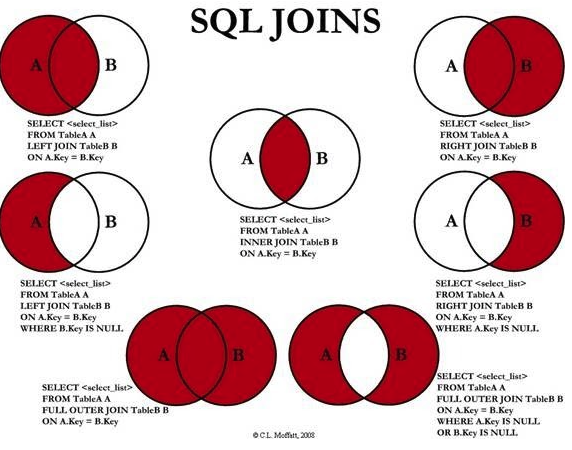

# Aula SQL

Esta aula tem como motivação ensinar SQL para alunos que não possuem experiência com a linguagem

Caso queira praticar junto com o professor, vc pode usar o seguinte endereço:

* https://sqliteonline.com/
* Escolher o PostgreSQL
* Conectar

Para testar se a conexão foi feita com sucesso, escreva o comando e aperte RUN

* select * from demo;


## Entendendo o problema

Precisamos modelar o seguinte problema:

> Acessar o seguinte [modelo proposto](https://drive.google.com/file/d/1oYMn-dyT1ygl0ub8fY560tsz47A7R3W7/view?usp=sharing)


* DOENÇA: nome, vacina?, data do primeiro caso
* INFECÇÃO: pais, doença, total, ultima_atualização


Vamos precisa descobrir alguma informações relaventes, como:

- Qual continente é o mais infectado?
- Qual país mais infectado?
- Qual país ainda tem Rubéola?


e muitas outras perguntas!

## Criando nosso banco

* Entendo a diferença dos comandos DDL e DML

Vamos criar nosso banco de dados!

Para criar:

* CREATE DATABASE ESTRATEGIA;

Para excluir:

* DROP DATABASE ESTRATEGIA;

## Criando as tabelas

```sql

CREATE TABLE CONTINENTE(
    id serial not null,
    nome varchar(50) not null,
    primary key (id)
);


CREATE TABLE PAIS(
    id serial not null,
    nome varchar(50) not null,
    total_populacao int,
    continente_id bigint not null,
    primary key (id),
    CONSTRAINT fk_pais_continente FOREIGN KEY(continente_id) REFERENCES CONTINENTE(id)
);


CREATE TABLE LABORATORIO(
    id serial not null,
    nome varchar(30),
    primary key (id)
);


CREATE TABLE DOENCA(
    id serial not null,
    nome varchar(100) not null,
    data_primeiro_caso date,
    laboratorio_responsavel_pela_vacina bigint,
    primary key (id),
    CONSTRAINT fk_doenca_labarotario FOREIGN KEY(laboratorio_responsavel_pela_vacina) REFERENCES LABORATORIO(id)
);


CREATE TABLE INFECCAO(
    pais_id bigint not null,
    doenca_id bigint not null,
    total_infectados int,
    primary key (pais_id, doenca_id),
    CONSTRAINT fk_infeccao_pais FOREIGN KEY(pais_id) REFERENCES PAIS(id),
    CONSTRAINT fk_infeccao_doenca FOREIGN KEY(doenca_id) REFERENCES DOENCA(id)
);

```


> Perceba que a ordem de criação é IMPORTANTE!

## Alterando estruturas

E se quiséssemos saber a última atualização sobre a infecção de uma determinada doença no País?

Teria que refazê-la novamente?


```sql

ALTER TABLE INFECCAO ADD COLUMN data_ultima_atualizacao date;

```

## Populando nossa base

```sql
-- inserindo os continentes

INSERT INTO CONTINENTE VALUES (1, 'América do Norte');
INSERT INTO CONTINENTE VALUES (2, 'América do Sul');
INSERT INTO CONTINENTE VALUES (3, 'Ásia');
INSERT INTO CONTINENTE VALUES (4, 'Europa');
INSERT INTO CONTINENTE VALUES (5, 'África');
INSERT INTO CONTINENTE VALUES (6, 'Oceania');
INSERT INTO CONTINENTE VALUES (7, 'Antártida');

-- inserindo dados em país

INSERT INTO PAIS (nome, total_populacao, continente_id) values ('brasil', 200, 2);
INSERT INTO PAIS (nome, total_populacao, continente_id) values ('estados unidos', 300, 1);
INSERT INTO PAIS (nome, total_populacao, continente_id) values ('uruguai', 11, 2);

INSERT INTO PAIS (nome, total_populacao, continente_id) values ('italia', 60, 4);
INSERT INTO PAIS (nome, total_populacao, continente_id) values ('alemanha', 80, 4);
INSERT INTO PAIS (nome, total_populacao, continente_id) values ('espanha', 47, 4);

INSERT INTO PAIS (nome, total_populacao, continente_id) values ('africa do sul', 57, 5);
INSERT INTO PAIS (nome, total_populacao, continente_id) values ('angola', 30, 5);


INSERT INTO PAIS (nome, total_populacao, continente_id) values ('japao', 126, 3);
INSERT INTO PAIS (nome, total_populacao, continente_id) values ('russia', 144, 3);


INSERT INTO PAIS (nome, total_populacao, continente_id) values ('australia', 25, 6);
INSERT INTO PAIS (nome, total_populacao, continente_id) values ('nova zelandia', 5, 6);


-- inserindo dados dos laborat[orio]

-- nesse caso, expressamos os campos que queremos inserir, pois não condiz com a ordem da tabela

INSERT INTO LABORATORIO (id, nome) values (1, 'FioCruz');
INSERT INTO LABORATORIO (id, nome) values (2, 'Sanofi');
INSERT INTO LABORATORIO (id, nome) values (3, 'Oxford');
INSERT INTO LABORATORIO (id, nome) values (4, 'Sinopharm');

-- inserindo dados das doenças

INSERT INTO DOENCA (id, nome, data_primeiro_caso, laboratorio_responsavel_pela_vacina) values (1, 'sarampo', '1912-10-12', 1);
INSERT INTO DOENCA (id, nome, data_primeiro_caso, laboratorio_responsavel_pela_vacina) values (2, 'gripe espanhola', '1929-04-1', 3);
INSERT INTO DOENCA (id, nome, data_primeiro_caso, laboratorio_responsavel_pela_vacina) values (3, 'rubeola', '1940-12-12', 1);
INSERT INTO DOENCA (id, nome, data_primeiro_caso, laboratorio_responsavel_pela_vacina) values (4, 'gripe', '1700-09-1', 2);
INSERT INTO DOENCA (id, nome, data_primeiro_caso, laboratorio_responsavel_pela_vacina) values (5, 'covid', '2019-12-12', null);
INSERT INTO DOENCA (id, nome, data_primeiro_caso, laboratorio_responsavel_pela_vacina) values (6, 'aids', '1990-1-1', null);

-- inserindo dados das infecções

-- dados do brasil
INSERT INTO INFECCAO values (1, 1, 10, '2018-01-01');
INSERT INTO INFECCAO values (1, 2, 0, '1960-01-01');
INSERT INTO INFECCAO values (1, 5, 85000, '2020-01-01');
INSERT INTO INFECCAO values (1, 6, 10000, '2020-01-01');

-- dados dos EUA
INSERT INTO INFECCAO values (2, 5, 300000, '2020-01-01');
INSERT INTO INFECCAO values (2, 1, 100, '2018-01-01');
INSERT INTO INFECCAO values (2, 6, 150000, '2018-01-01');

-- dados do uruguai
INSERT INTO INFECCAO values (3, 1, 20, '2020-01-01');
INSERT INTO INFECCAO values (3, 2, 30, '2020-01-01');
INSERT INTO INFECCAO values (3, 3, 40, '2020-01-01');
INSERT INTO INFECCAO values (3, 4, 50, '2020-01-01');
INSERT INTO INFECCAO values (3, 5, 60, '2020-01-01');
INSERT INTO INFECCAO values (3, 6, 70, '2020-01-01');

--dados da italia
INSERT INTO INFECCAO values (4, 5, 500232, '2020-01-01');
INSERT INTO INFECCAO values (4, 6, 100, '2018-01-01');

--dados da alemanha
INSERT INTO INFECCAO values (5, 5, 2340, '2020-01-01');

--dados da espanha
INSERT INTO INFECCAO values (6, 1, 1, '2020-01-01');
INSERT INTO INFECCAO values (6, 2, 1, '2020-01-01');
INSERT INTO INFECCAO values (6, 3, 1, '2020-01-01');
INSERT INTO INFECCAO values (6, 4, 1, '2020-01-01');
INSERT INTO INFECCAO values (6, 5, 400, '2020-01-01');


--dados da africa do sul
INSERT INTO INFECCAO values (7, 5, 1000, '2020-01-01');
INSERT INTO INFECCAO values (7, 6, 900000, '2020-01-01');

--dados da angola
INSERT INTO INFECCAO values (8, 5, 2000, '2020-01-01');
INSERT INTO INFECCAO values (8, 6, 800000, '2020-01-01');

--dados do japao
INSERT INTO INFECCAO values (9, 5, 200, '2020-01-01');

--dados da russia
INSERT INTO INFECCAO values (10, 1, 20, '2020-01-01');
INSERT INTO INFECCAO values (10, 6, 10, '2020-01-01');

--dados da da australia
INSERT INTO INFECCAO values (11, 1, 123, '2020-01-01');
INSERT INTO INFECCAO values (11, 2, 143, '2020-01-01');
INSERT INTO INFECCAO values (11, 3, 154, '2020-01-01');
INSERT INTO INFECCAO values (11, 4, 122, '2020-01-01');
INSERT INTO INFECCAO values (11, 5, 400, '2020-01-01');

--dados da nova zelandia
INSERT INTO INFECCAO values (12, 1, 4, '2020-01-01');


```

Vamos Conferir?

```sql
select * from CONTINENTE
```


## Dados incompletos

O que aconteceria se tentássemos inserir país com um código de continente que não existe?

```sql
--código de continente inexistente
INSERT INTO PAIS (nome, total_populacao, continente_id) values ('argentina', 200, 20);
```

## Atualizando dados

O que deveria ser feito caso em um país aumentasse o número total de infectados?

Quantos casos de de covid o Brasil possui?

```sql
SELECT * from INFECCAO;
```

Mas queremos saber apenas do BRASIL e COVID!

* cláusula WHERE

```sql
SELECT * from INFECCAO where pais_id = 1
```

Mas queremos COVID!

```sql
SELECT * from INFECCAO where pais_id = 1 and doenca_id = 5
```

Mas queremos apenas o TOTAL de infectados

```sql
SELECT total_infectados from INFECCAO where pais_id = 1 and doenca_id = 5
```

Precisamos atualizar a tabela de INFECCAO!!

> Brasil acaba de reportar um aumento do numero de casos de covid atingindo 100 mil casos

```sql
update INFECCAO set total_infectados = 100000, data_ultima_atualizacao = '2020-11-01' WHERE pais_id = 1 and doenca_id = 5;

SELECT total_infectados from INFECCAO where pais_id = 1 and doenca_id = 5
```


## Removendo dados

Uruguai acaba de reportar que não possui mais casos de SARAMPO!

```sql
  delete from INFECCAO where pais_id = 3 and doenca_id = 1;
```

> O que seria melhor fazer nesse caso? Atualizar ou deletar! Não sabemos, é basicamente uma decisão negocial!


* Curiosidade! Teria como Remover o continente EUROPEU?

```sql
  delete from CONTINENTE where continente_id = 4;
```

Exatamente! A integridade referencial mantém o banco **íntegro**

# Consultas usando o SELECT

Como fazer para pesquisar as doenças e países cadastrados?

* Como trazer os países?

```sql
SELECT * FROM PAIS;
SELECT * FROM PAIS ORDER BY NOME;
SELECT * FROM PAIS ORDER BY total_populacao desc;
```

* Países com a população maior do que 100

```sql
SELECT * FROM PAIS WHERE total_populacao > 100;
```


* Mas como trazer o nome do país e o continente dele?

```sql
SELECT p.nome, p.continente_id FROM PAIS as p;
```

* Não fica legal, tá faltando o nome do continente

```sql
SELECT p.nome, c.nome FROM PAIS as p, CONTINENTE as c
```

> Por que gerou esse resultado estranho? Pois na verdade ele fez uma combinação baseada em um produto cartesiano
> 
> 
> 
> [Entenda mais sobre clicando aqui](https://mundoeducacao.uol.com.br/matematica/produto-cartesiano.htm#:~:text=Produto%20cartesiano%20%C3%A9%20a%20multiplica%C3%A7%C3%A3o%20entre%20pares%20ordenados%20envolvendo%20conjuntos%20distintos.)


Bom, precisamos resolver nosso problema! Então o que nós queremos?

Queremos trazer os países mas mostrar somente o seu continente associado, sem combinação

* Precisamos fazer a restrição usando o WHERE

```sql
SELECT p.nome, c.nome FROM PAIS as p, CONTINENTE as c WHERE p.continente_id = c.id 

SELECT p.nome, c.nome FROM PAIS as p INNER JOIN CONTINENTE c ON p.continente_id = c.id 

```

> Apenas curiosidade, há uma variação dos inners joins composta por: left join, right join, 
> mas como é uma curso de SQL básico, vamos ficar só no inner join mesmo


* Vamos trazer todos os laboratórios que produziram vacinas

```sql
SELECT l.nome, d.nome FROM LABORATORIO as l INNER JOIN DOENCA as d
  on d.laboratorio_responsavel_pela_vacina = l.id
```


Tem laboratório faltando né?


* apenas por curiosidade, vamos trazer ele também

```sql
SELECT l.nome, d.nome FROM LABORATORIO as l LEFT JOIN DOENCA as d
  on d.laboratorio_responsavel_pela_vacina = l.id
```

e tem doença faltando né?

* apenas por curiosidade, vamos trazer ela também

```sql
SELECT l.nome, d.nome FROM LABORATORIO as l RIGHT JOIN DOENCA as d
  on d.laboratorio_responsavel_pela_vacina = l.id
```


E se a gente quisesse trazer tudo?

* apenas por 

```sql
SELECT l.nome, d.nome FROM LABORATORIO as l FULL OUTER JOIN DOENCA as d
  on d.laboratorio_responsavel_pela_vacina = l.id
```


* Esquema de JOINS!





> Atenção, mais uma vez, vamos nos limitar apenas ao INNER JOIN, os outros são mais complicados, mais nível T.I! Estão aqui apenas por curiosidade


## Mais sobre operadores lógicos

* E se quisemos listar somente os países da América e Oceania?

já vimos o operador **AND** no UPDATE, agora vamos ver o **OR**

```sql
select * from PAIS as p INNER JOIN CONTINENTE as c ON p.continente_id = c.id where c.nome = 'Europa' or c.nome = 'Oceania';
```

* Quais doenças já possuem vacinas?

```sql
select * from DOENCA where laboratorio_responsavel_pela_vacina is not null;
```


## LIKE

* vamos trazer somente os países que começam com a letra A?

```sql
select * from PAIS where nome like 'a%';
```

* vamos trazer somente os países que terminam com a letra A?

```sql
select * from PAIS where nome like '%a';
```

* vamos trazer somente os países que possuem a letra A na terceira letra?

```sql
select * from PAIS where nome like '__a%';
```


## DISTINCT

Precisamos descobrir agora todos os países que possuem alguma infecção

```sql
select p.nome from INFECCAO as i, PAIS as p where p.id = i.pais_id;
```

O que há de errado com nossa consulta?

```sql
select DISTINCT p.nome from INFECCAO as i, PAIS as p where p.id = i.pais_id order by p.nome
```


## Funções de agregação

São funções existentes no SQL com a finalidade de trazer informaçõe resumidas

[Saiba mais em](https://www.devmedia.com.br/sql-funcoes-de-agregacao/38463)


* quantas doenças existem?

```sql
select count(*) from DOENCA
```

* Qual país tem a maior população

**max()** || **min()**

```sql
select max(total_populacao) from PAIS
```

Mas como descobrir os dados do País?


```sql
SELECT * from PAIS
  where total_populacao = (select max(total_populacao) from PAIS)
```

> Subselect também pode ser um conceito mais avançado, mas dá pra entender bem
> como funciona

* Qual é o total da população mundial?

```sql
SELECT sum(total_populacao) from PAIS
```

* Qual é o total da população da América do Sul

```sql
SELECT sum(total_populacao) from PAIS
  where continente_id = 2
```

* Qual a quantidade de infectados no mundo por covid?


```sql
SELECT sum(total_infectados) from INFECCAO
  where doenca_id = 5
```

* Qual é a média da população mundial?

```sql
SELECT avg(total_populacao) from PAIS
```


* Qual país está mais infectados com covid?

```sql
select p.nome, i.total_infectados as total from PAIS as p 
	left join INFECCAO as i
	on p.id = i.pais_id
	where doenca_id = 5 order by total desc
```

* Qual pais está menos infectados com covid?


```sql
select p.nome from PAIS as p 
	inner join INFECCAO as i
	on p.id = i.pais_id
	where i.total_infectados = (select min(total_infectados) from INFECCAO where doenca_id = 5)
```


* Qual país ainda tem Rubéola?

```sql

select p.nome
	from PAIS as p INNER JOIN INFECCAO as i
	ON p.id = i.pais_id
	where i.doenca_id = 3

```


## GROUP BY


* Qual é o total da população agrupada por continente?

```sql

-- aqui vai gerar um erro! pois é necessário a função de agregação
SELECT continente_id, sum(total_populacao) from PAIS

-- essa vai funcionar
SELECT continente_id, sum(total_populacao) from PAIS
	group by continente_id order by continente_id
```

Mas e se a gente quisesse mostrar o nome do país?

```sql
SELECT c.nome, sum(p.total_populacao) 
  from PAIS as p inner join CONTINENTE as c
	on p.continente_id = c.id
	group by c.nome order by c.nome
```

Vamos ver se vc entendeu!!!


* Vamos tentar descobrir agora qual é o país mais infectado!

```sql

select p.nome, sum(i.total_infectados) as total 
  from PAIS as p 
	inner join INFECCAO as i
	on p.id = i.pais_id
	group by p.nome order by total desc
	
```

* Qual o continente mais afetado pelo Covid?

```sql

select c.nome, sum(i.total_infectados) as total from PAIS as p 
	inner join INFECCAO as i
	on p.id = i.pais_id
	inner join CONTINENTE as c
	on p.continente_id = c.id
  where i.doenca_id = 5
	group by c.nome order by total desc
	
```

> Eita! Que medo! tá duvidando que está certo?
> 
> Conta aí! Faz um select na tabela INFECÇÃO e conta aí!
> 


E se a gente quisesse mostrar só os continentes > 500 mil?

```sql
select c.nome, sum(i.total_infectados) as total from PAIS as p 
	inner join INFECCAO as i
	on p.id = i.pais_id
	inner join CONTINENTE as c
	on p.continente_id = c.id
	group by c.nome having sum(i.total_infectados) > 500000 order by total desc

```


* Quantos vacinas cada laboratório já produziu?

```sql

select l.nome, count(laboratorio_responsavel_pela_vacina) as total
	from LABORATORIO as l INNER JOIN DOENCA as d
	ON l.id = d.laboratorio_responsavel_pela_vacina
	group by l.nome order by total desc
	
```

* Quantos países tem cada continente?

```sql
select c.nome, count(*) 
	from PAIS as p INNER JOIN CONTINENTE as c 
	ON p.continente_id = c.id
	group by c.nome
```


* Qual país possui a maior quantidade de doenças?

```sql
select p.nome, count(*) as total
	from PAIS as p INNER JOIN INFECCAO as i
	ON p.id = i.pais_id
	group by p.nome order by total desc
```
